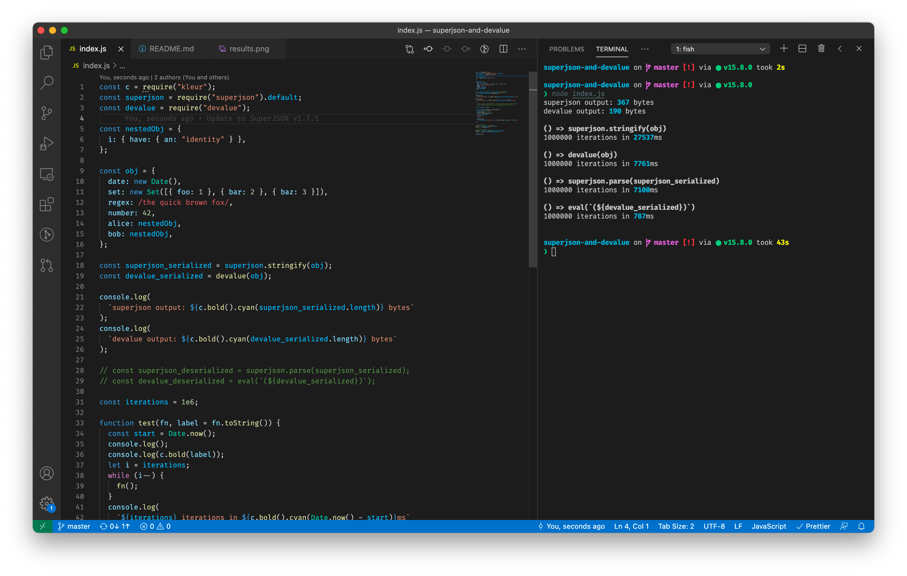

# superjson-and-devalue

quick script to compare the performance/output of [superjson](https://github.com/blitz-js/superjson) and [devalue](https://github.com/Rich-Harris/devalue), following [this Twitter thread](https://twitter.com/flybayer/status/1285964795183652867).

```
git clone git@github.com:Rich-Harris/superjson-and-devalue
cd superjson-and-devalue
npm i
node index.js
```

The sample object is small and simple — different objects may have different outcomes.

Note: I couldn't get things like Sets or repeated references to work with superjson (it complained about circular references).

